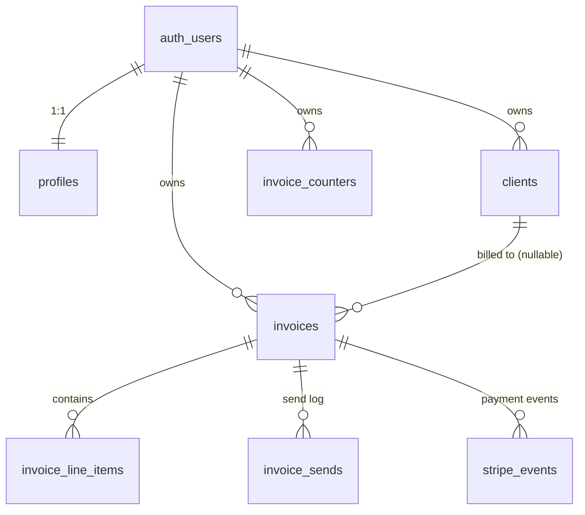

# Invoice Generator — Database Schema

**Last updated:** 2026-07-30
**Companion documents:** [PRD.md](PRD.md) (product), [Tech.md](Tech.md) (architecture)
**Target:** Supabase Postgres, project `rrffjgmvwreldgrwlykp` — **applied** 2026-07-30 (13 migrations, 7 tables, 1 view)

---

## 1. Design principles

1. **RLS is the security boundary.** Every table has row level security enabled and policies keyed on `auth.uid()`. Application code is the second line of defence, never the first.
2. **Money is integer cents.** `bigint` everywhere. VAT rates are integer basis points (17 % → `1700`). No floating point touches an amount.
3. **The database owns the arithmetic.** Line totals are generated columns; invoice totals are maintained by trigger. The application cannot save a total that disagrees with its lines.
4. **Issued invoices are immutable history.** Sender and client details are snapshotted onto the invoice. Deleting a client or editing a profile cannot rewrite the past.
5. **Business rules that protect money live in the database.** The lock on Stripe-confirmed invoices is a trigger, not a UI condition.
6. **Every `auth.uid()` call is wrapped in a subquery** — `(select auth.uid())` — so Postgres evaluates it once per statement instead of once per row, and every policy names its role with `to authenticated` so it is not evaluated for anonymous requests.

---

## 2. Entity overview



| Table | Purpose |
|---|---|
| `profiles` | Sender details, default currency, Stripe Connect account state. 1:1 with `auth.users`. |
| `clients` | The user's client book. |
| `invoices` | One row per invoice, including frozen sender/client snapshots, totals, PDF pointer, Stripe link, and payment state. |
| `invoice_line_items` | Line items, with per-line generated subtotal and tax. |
| `invoice_counters` | Per-user, per-month sequence allocator for invoice numbers. |
| `invoice_sends` | Append-only log of every email send attempt. |
| `stripe_events` | Processed Stripe event ids — the webhook idempotency gate. |
| `invoice_vat_breakdown` | View: net and tax grouped by VAT rate, for the invoice screen and PDF. |

---

## 3. Extensions and enums

```sql
create extension if not exists pg_trgm with schema extensions;

create type public.invoice_status as enum ('not_paid', 'paid');
create type public.line_unit_type as enum ('hours', 'flat');
create type public.paid_source    as enum ('stripe', 'manual');
create type public.send_status    as enum ('sent', 'failed');
```

`pg_trgm` backs the invoice list's substring search on invoice number and client name.

Supported currencies are a `check` constraint rather than an enum, so adding one later is a constraint change and not a type migration:

```
'EUR', 'USD', 'GBP', 'CHF', 'BAM'
```

---

## 4. Tables

### 4.1 `profiles`

```sql
create table public.profiles (
  id                       uuid primary key references auth.users (id) on delete cascade,

  full_name                text,
  company_name             text,
  email                    text,
  address                  text,
  vat_id                   text,
  website                  text,

  default_currency         text not null default 'EUR'
                             check (default_currency in ('EUR','USD','GBP','CHF','BAM')),

  -- Stripe Connect (Express)
  stripe_account_id        text unique,
  stripe_details_submitted boolean not null default false,
  stripe_charges_enabled   boolean not null default false,

  created_at               timestamptz not null default now(),
  updated_at               timestamptz not null default now()
);
```

All identity fields are nullable, as the PRD specifies. `stripe_charges_enabled` is what gates the Send button; it is refreshed from the Stripe onboarding return and from `account.updated` webhooks.

The row is created automatically on signup (§6.1), so no code path has to handle a missing profile.

### 4.2 `clients`

```sql
create table public.clients (
  id           uuid primary key default gen_random_uuid(),
  user_id      uuid not null references auth.users (id) on delete cascade,

  full_name    text,
  company_name text,
  email        text,
  address      text,
  vat_id       text,

  created_at   timestamptz not null default now(),
  updated_at   timestamptz not null default now(),

  constraint clients_display_name_present check (
    coalesce(nullif(btrim(full_name), ''), nullif(btrim(company_name), '')) is not null
  )
);

create index clients_user_created_idx on public.clients (user_id, created_at desc);
```

`clients_display_name_present` is the single constraint added on top of the spec: a client needs *some* name to be selectable in a dropdown and printable in the To block. Email stays nullable — the product handles a missing email by disabling Send rather than by rejecting the record.

### 4.3 `invoice_counters`

```sql
create table public.invoice_counters (
  user_id  uuid     not null references auth.users (id) on delete cascade,
  year     smallint not null,
  month    smallint not null,
  last_seq integer  not null default 0,

  primary key (user_id, year, month)
);
```

No RLS policies are written for this table. It is reachable only through the security-definer function in §6.2, so the counter cannot be tampered with directly.

### 4.4 `invoices`

```sql
create table public.invoices (
  id                          uuid primary key default gen_random_uuid(),
  user_id                     uuid not null references auth.users (id) on delete cascade,
  client_id                   uuid references public.clients (id) on delete set null,

  -- numbering
  invoice_number              text     not null,
  number_year                 smallint not null,
  number_month                smallint not null,
  number_seq                  integer  not null,

  -- header
  status                      public.invoice_status not null default 'not_paid',
  currency                    text not null check (currency in ('EUR','USD','GBP','CHF','BAM')),
  invoice_date                date not null default current_date,
  due_date                    date not null,

  -- totals, maintained by trigger from the line items
  subtotal_cents              bigint not null default 0,
  tax_cents                   bigint not null default 0,
  total_cents                 bigint not null default 0,

  comments                    text,

  -- frozen sender snapshot (from profiles at creation time)
  sender_full_name            text,
  sender_company_name         text,
  sender_email                text,
  sender_address              text,
  sender_vat_id               text,
  sender_website              text,

  -- frozen client snapshot (from clients at creation time)
  client_full_name            text,
  client_company_name         text,
  client_email                text,
  client_address              text,
  client_vat_id               text,

  -- PDF
  pdf_path                    text,
  pdf_generated_at            timestamptz,

  -- sending
  sent_at                     timestamptz,
  edited_after_send           boolean not null default false,

  -- Stripe payment link
  stripe_payment_link_id      text,
  stripe_payment_link_url     text,
  stripe_payment_link_active  boolean not null default true,

  -- payment state
  paid_at                     timestamptz,
  paid_source                 public.paid_source,
  stripe_confirmed_paid       boolean not null default false,
  amount_received_cents       bigint,
  payment_mismatch            boolean not null default false,

  -- search
  search_text                 text generated always as (
                                coalesce(invoice_number, '')      || ' ' ||
                                coalesce(client_full_name, '')    || ' ' ||
                                coalesce(client_company_name, '')
                              ) stored,

  created_at                  timestamptz not null default now(),
  updated_at                  timestamptz not null default now(),

  constraint invoices_id_user_unique     unique (id, user_id),
  constraint invoices_number_unique      unique (user_id, invoice_number),
  constraint invoices_seq_unique         unique (user_id, number_year, number_month, number_seq),
  constraint invoices_due_after_issue    check (due_date >= invoice_date),
  constraint invoices_amounts_signed     check (subtotal_cents >= 0 and tax_cents >= 0 and total_cents >= 0),
  constraint invoices_total_consistent   check (total_cents = subtotal_cents + tax_cents),
  constraint invoices_paid_has_source    check (status <> 'paid' or paid_source is not null),
  constraint invoices_client_snapshot    check (
    coalesce(nullif(btrim(client_full_name), ''), nullif(btrim(client_company_name), '')) is not null
  )
);
```

**Indexes:**

```sql
create index invoices_user_date_idx    on public.invoices (user_id, invoice_date desc, id desc);
create index invoices_user_status_idx  on public.invoices (user_id, status);
create index invoices_user_total_idx   on public.invoices (user_id, total_cents desc);
create index invoices_client_idx       on public.invoices (client_id);
create index invoices_overdue_idx      on public.invoices (user_id, due_date) where status = 'not_paid';
create index invoices_search_idx       on public.invoices using gin (search_text extensions.gin_trgm_ops);

create unique index invoices_payment_link_idx
  on public.invoices (stripe_payment_link_id)
  where stripe_payment_link_id is not null;
```

`invoices_user_date_idx` serves the default list ordering, `invoices_overdue_idx` is a partial index sized to only the rows the Overdue filter can match, and `invoices_client_idx` exists because an unindexed foreign key makes every client delete scan the invoice table.

**Notes on specific columns:**

| Column | Why it exists |
|---|---|
| `client_id` nullable, `on delete set null` | Clients are hard-deleted. The snapshot columns keep the invoice intact, and `invoices_client_snapshot` guarantees the snapshot was populated in the first place. |
| `status` vs `stripe_confirmed_paid` | `status` is freely toggleable by the user in both directions. `stripe_confirmed_paid` is set only by the webhook and is what permanently locks the row (§6.4). They are deliberately separate. |
| `paid_source` | Records *how* an invoice came to be paid. Kept even after a toggle back to `not_paid`, as history. |
| `amount_received_cents` + `payment_mismatch` | Populated when Stripe reports a payment that does not equal `total_cents`. The invoice stays unpaid and the UI shows the warning. |
| `edited_after_send` | Set by trigger when a sent invoice's content changes; cleared when it is actually resent. Drives the *Edited after sending* badge. |
| `stripe_payment_link_active` | Flipped to `false` when the invoice is deleted, mirroring the deactivation in Stripe. |
| `search_text` | Generated, so the trigram index cannot drift out of sync with the columns it indexes. |

### 4.5 `invoice_line_items`

```sql
create table public.invoice_line_items (
  id                  uuid primary key default gen_random_uuid(),
  invoice_id          uuid not null,
  user_id             uuid not null,

  position            smallint not null,
  description         text not null check (btrim(description) <> ''),
  unit_type           public.line_unit_type not null default 'hours',
  quantity            numeric(12,2) not null default 1 check (quantity > 0),
  unit_price_cents    bigint  not null default 0 check (unit_price_cents >= 0),
  vat_rate_bps        integer not null default 0 check (vat_rate_bps between 0 and 10000),

  line_subtotal_cents bigint generated always as
                        (round(quantity * unit_price_cents)::bigint) stored,
  line_tax_cents      bigint generated always as
                        (round(round(quantity * unit_price_cents) * vat_rate_bps / 10000.0)::bigint) stored,

  created_at          timestamptz not null default now(),

  constraint line_items_invoice_fk foreign key (invoice_id, user_id)
    references public.invoices (id, user_id) on delete cascade,
  constraint line_items_flat_quantity check (unit_type <> 'flat' or quantity = 1),
  constraint line_items_position_unique unique (invoice_id, position) deferrable initially immediate
);

create index line_items_invoice_idx on public.invoice_line_items (invoice_id, position);
create index line_items_user_idx    on public.invoice_line_items (user_id);
```

**The composite foreign key `(invoice_id, user_id) → invoices (id, user_id)`** is what makes the denormalized `user_id` trustworthy. A line item cannot claim an owner different from its invoice's owner, so the simple `user_id = auth.uid()` RLS policy on this table is genuinely sufficient — no join required in the policy.

**Generated columns implement the rounding rule from the PRD**: each line is rounded to whole cents, and the invoice totals sum those already-rounded values. Rounding cannot drift, because there is no other code path that computes a line total.

`line_items_flat_quantity` enforces the `flat` semantics — quantity pinned to 1 — at the database level, not just by disabling an input.

The unique constraint on `(invoice_id, position)` is `deferrable` so a reorder within one transaction is legal. In practice, editing an invoice deletes and reinserts its line items, which avoids transient collisions entirely.

### 4.6 `invoice_sends`

```sql
create table public.invoice_sends (
  id                uuid primary key default gen_random_uuid(),
  invoice_id        uuid not null,
  user_id           uuid not null,

  to_email          text not null,
  status            public.send_status not null,
  resend_message_id text,
  error_message     text,
  pdf_path          text,

  created_at        timestamptz not null default now(),

  constraint invoice_sends_invoice_fk foreign key (invoice_id, user_id)
    references public.invoices (id, user_id) on delete cascade
);

create index invoice_sends_invoice_idx on public.invoice_sends (invoice_id, created_at desc);
create index invoice_sends_user_idx    on public.invoice_sends (user_id);
```

Append-only: there are `select` and `insert` policies and deliberately no `update` or `delete` policy, so a user cannot rewrite their own send history.

### 4.7 `stripe_events`

```sql
create table public.stripe_events (
  id                text primary key,          -- Stripe event id, e.g. evt_1A2b3C
  type              text not null,
  stripe_account_id text,
  invoice_id        uuid references public.invoices (id) on delete set null,
  payload           jsonb,
  received_at       timestamptz not null default now()
);

create index stripe_events_invoice_idx on public.stripe_events (invoice_id);
```

**The primary key is the idempotency mechanism.** The webhook's first action is to insert the event id; a unique violation means this event was already handled, so it returns `200` and does nothing further. Making this a database constraint rather than a `select`-then-`insert` check is what makes it safe when Stripe delivers the same event twice concurrently.

RLS is enabled with **no policies at all** — the table is reachable only by the service-role client used inside the webhook.

### 4.8 `invoice_vat_breakdown` (view)

```sql
create view public.invoice_vat_breakdown
with (security_invoker = on) as
select
  invoice_id,
  user_id,
  vat_rate_bps,
  sum(line_subtotal_cents) as net_cents,
  sum(line_tax_cents)      as tax_cents
from public.invoice_line_items
group by invoice_id, user_id, vat_rate_bps;
```

Supplies the per-rate VAT breakdown for the invoice screen and PDF. `security_invoker = on` is essential — without it the view would run with its owner's privileges and bypass the line items' RLS.

---

## 5. Row level security

Every table has `alter table … enable row level security`. Policies are split per operation and scoped `to authenticated`.

### 5.1 `profiles`

```sql
create policy profiles_select_own on public.profiles
  for select to authenticated using (id = (select auth.uid()));

create policy profiles_update_own on public.profiles
  for update to authenticated
  using (id = (select auth.uid()))
  with check (id = (select auth.uid()));
```

No `insert` policy — the signup trigger creates the row. No `delete` policy — removal cascades from `auth.users`.

### 5.2 `clients`, `invoices`, `invoice_line_items`

The same four policies on each, keyed on `user_id`:

```sql
create policy <table>_select_own on public.<table>
  for select to authenticated using (user_id = (select auth.uid()));

create policy <table>_insert_own on public.<table>
  for insert to authenticated with check (user_id = (select auth.uid()));

create policy <table>_update_own on public.<table>
  for update to authenticated
  using (user_id = (select auth.uid()))
  with check (user_id = (select auth.uid()));

create policy <table>_delete_own on public.<table>
  for delete to authenticated using (user_id = (select auth.uid()));
```

The `using` clause governs which existing rows are visible to the operation; the `with check` clause governs the row's state afterwards. Both are required on `update`, otherwise a user could reassign a row to another `user_id`.

### 5.3 `invoice_sends`

`select` and `insert` only, both on `user_id = (select auth.uid())`. No `update`, no `delete`.

### 5.4 `invoice_counters` and `stripe_events`

RLS enabled, **no policies**. Neither table is ever touched by a user-session client:

- `invoice_counters` — only via `next_invoice_number()`, which is `security definer`
- `stripe_events` — only via the service-role client in the webhook

### 5.5 Storage

```sql
insert into storage.buckets (id, name, public)
values ('invoices', 'invoices', false)
on conflict (id) do nothing;
```

Object path convention: **`{user_id}/{invoice_id}.pdf`**, which makes the first path segment the owner and lets the policies be a simple folder check:

```sql
create policy invoice_pdf_select_own on storage.objects
  for select to authenticated
  using (
    bucket_id = 'invoices'
    and (storage.foldername(name))[1] = (select auth.uid())::text
  );
```

The same predicate is repeated for `insert` (as `with check`), `update`, and `delete`. The bucket is private; PDFs are served through an authenticated route handler, and signed URLs — where unavoidable — are issued with a 60-second lifetime.

---

## 6. Functions and triggers

### 6.1 Profile bootstrap

```sql
create function public.handle_new_user()
returns trigger
language plpgsql
security definer
set search_path = ''
as $$
begin
  insert into public.profiles (id, email)
  values (new.id, new.email)
  on conflict (id) do nothing;
  return new;
end;
$$;

create trigger on_auth_user_created
  after insert on auth.users
  for each row execute function public.handle_new_user();
```

`set search_path = ''` with fully qualified table names is mandatory on every `security definer` function — without it, a caller-controlled `search_path` can redirect the function to a different table.

### 6.2 Invoice number allocation

```sql
create function public.next_invoice_number(p_invoice_date date default current_date)
returns table (invoice_number text, number_year smallint, number_month smallint, number_seq integer)
language plpgsql
security definer
set search_path = ''
as $$
declare
  v_user_id uuid     := (select auth.uid());
  v_year    smallint := extract(year  from p_invoice_date)::smallint;
  v_month   smallint := extract(month from p_invoice_date)::smallint;
  v_seq     integer;
begin
  if v_user_id is null then
    raise exception 'not authenticated' using errcode = '42501';
  end if;

  insert into public.invoice_counters (user_id, year, month, last_seq)
  values (v_user_id, v_year, v_month, 1)
  on conflict (user_id, year, month)
    do update set last_seq = public.invoice_counters.last_seq + 1
  returning public.invoice_counters.last_seq into v_seq;

  return query select
    format('INV-%s-%s-%s', v_year::text,
                           lpad(v_month::text, 2, '0'),
                           lpad(v_seq::text,   4, '0')),
    v_year, v_month, v_seq;
end;
$$;

revoke all     on function public.next_invoice_number(date) from public;
grant  execute on function public.next_invoice_number(date) to authenticated;
```

Produces `INV-2026-07-0001`, resetting per user per month.

**Why this is concurrency-safe.** `insert … on conflict do update … returning` acquires a row lock on the counter and performs read-modify-write as a single atomic statement. Two simultaneous requests serialize on that lock and receive different sequence numbers. The `unique (user_id, number_year, number_month, number_seq)` constraint on `invoices` is the backstop if anything ever bypasses this function.

The user id comes from `auth.uid()` inside the function rather than from a parameter, so a caller cannot allocate a number in someone else's sequence.

### 6.3 Totals recomputation

```sql
create function public.recompute_invoice_totals()
returns trigger
language plpgsql
security definer
set search_path = ''
as $$
declare
  v_invoice_id uuid := coalesce(new.invoice_id, old.invoice_id);
begin
  update public.invoices i
     set subtotal_cents = coalesce(t.subtotal, 0),
         tax_cents      = coalesce(t.tax, 0),
         total_cents    = coalesce(t.subtotal, 0) + coalesce(t.tax, 0),
         updated_at     = now()
    from (
      select sum(line_subtotal_cents) as subtotal,
             sum(line_tax_cents)      as tax
        from public.invoice_line_items
       where invoice_id = v_invoice_id
    ) t
   where i.id = v_invoice_id;

  return null;
end;
$$;

create trigger invoice_line_items_recompute
  after insert or update or delete on public.invoice_line_items
  for each row execute function public.recompute_invoice_totals();
```

Row-level rather than statement-level with transition tables: an invoice has on the order of ten line items, so the extra updates inside one transaction are negligible, and the simpler trigger is easier to reason about. Revisit only if invoices ever carry hundreds of lines.

This is what makes `invoices_total_consistent` always satisfiable — the application never computes and writes totals itself.

### 6.4 The paid-invoice lock

```sql
create function public.guard_locked_invoice()
returns trigger
language plpgsql
set search_path = ''
as $$
begin
  if tg_op = 'DELETE' then
    if old.stripe_confirmed_paid then
      raise exception 'Invoice % was paid through Stripe and cannot be deleted', old.invoice_number
        using errcode = 'check_violation';
    end if;
    if old.status = 'paid' then
      raise exception 'Invoice % is paid and cannot be deleted', old.invoice_number
        using errcode = 'check_violation';
    end if;
    return old;
  end if;

  -- UPDATE. Status, payment bookkeeping, PDF pointer and send state stay writable
  -- so the user can still toggle status and the webhook can still record a payment.
  if old.stripe_confirmed_paid and (
       new.invoice_number is distinct from old.invoice_number
    or new.currency       is distinct from old.currency
    or new.invoice_date   is distinct from old.invoice_date
    or new.due_date       is distinct from old.due_date
    or new.client_id      is distinct from old.client_id
    or new.comments       is distinct from old.comments
    or new.subtotal_cents is distinct from old.subtotal_cents
    or new.tax_cents      is distinct from old.tax_cents
    or new.total_cents    is distinct from old.total_cents
  ) then
    raise exception 'Invoice % was paid through Stripe and cannot be edited', old.invoice_number
      using errcode = 'check_violation';
  end if;

  return new;
end;
$$;

create trigger invoices_guard_locked
  before update or delete on public.invoices
  for each row execute function public.guard_locked_invoice();
```

This encodes both rules exactly as decided:

- **PRD §5.3** — a `paid` invoice cannot be deleted. To delete it, toggle it to `not paid` first, which the user is free to do.
- **Permanent lock** — an invoice whose payment Stripe confirmed can never be edited or deleted, *even after* the user toggles its status back to `not paid`. Real money moved; the record is closed.

The status column itself is intentionally excluded from the guarded list, because the free two-way toggle is a product requirement.

A matching guard on the child table stops the same lock being circumvented by editing line items:

```sql
create function public.guard_locked_invoice_lines()
returns trigger
language plpgsql
security definer
set search_path = ''
as $$
declare
  v_locked boolean;
begin
  select stripe_confirmed_paid into v_locked
    from public.invoices
   where id = coalesce(new.invoice_id, old.invoice_id);

  if v_locked then
    raise exception 'Line items of a Stripe-paid invoice cannot be changed'
      using errcode = 'check_violation';
  end if;

  return coalesce(new, old);
end;
$$;

create trigger invoice_line_items_guard_locked
  before insert or update or delete on public.invoice_line_items
  for each row execute function public.guard_locked_invoice_lines();
```

### 6.5 Edited-after-send flag

```sql
create function public.mark_invoice_edited_after_send()
returns trigger
language plpgsql
set search_path = ''
as $$
begin
  if old.sent_at is not null
     and new.sent_at is not distinct from old.sent_at
     and (
          new.currency       is distinct from old.currency
       or new.invoice_date   is distinct from old.invoice_date
       or new.due_date       is distinct from old.due_date
       or new.client_id      is distinct from old.client_id
       or new.comments       is distinct from old.comments
       or new.subtotal_cents is distinct from old.subtotal_cents
       or new.tax_cents      is distinct from old.tax_cents
       or new.total_cents    is distinct from old.total_cents
     )
  then
    new.edited_after_send := true;
  end if;

  return new;
end;
$$;

create trigger invoices_mark_edited_after_send
  before update on public.invoices
  for each row execute function public.mark_invoice_edited_after_send();
```

The `new.sent_at is not distinct from old.sent_at` condition is what lets a successful resend clear the flag: the resend sets `sent_at` and `edited_after_send = false` in the same statement, and because `sent_at` changed the trigger does not re-raise the flag.

### 6.6 `updated_at`

```sql
create function public.set_updated_at()
returns trigger
language plpgsql
set search_path = ''
as $$
begin
  new.updated_at := now();
  return new;
end;
$$;
```

Attached `before update … for each row` to `profiles`, `clients`, and `invoices`.

---

## 7. How the application uses this schema

### Creating an invoice (one transaction)

1. `select * from next_invoice_number($invoice_date)` → number and its `year` / `month` / `seq` parts
2. Read the caller's `profiles` row and the chosen `clients` row
3. `insert into invoices (…)` with the number, the header fields, and **both snapshots copied inline**
4. `insert into invoice_line_items (…)` for each row — generated columns compute line subtotal and tax, and the trigger folds them into the invoice totals
5. Read the invoice back, render the PDF from *those* values, upload to `invoices/{user_id}/{invoice_id}.pdf`, and set `pdf_path` / `pdf_generated_at`
6. Create the Stripe payment link and store `stripe_payment_link_id` / `_url`

### Editing an invoice

Delete all line items for the invoice and reinsert them — this avoids position collisions and lets the totals trigger settle naturally. Then regenerate and overwrite the PDF. The number and the payment link are never touched.

### Webhook marking an invoice paid

```sql
-- 1. idempotency gate; a unique violation here means "already processed"
insert into stripe_events (id, type, stripe_account_id, invoice_id, payload) values (…);

-- 2. exact-amount match only
update invoices
   set status = 'paid', paid_at = now(), paid_source = 'stripe', stripe_confirmed_paid = true
 where id = $invoice_id and total_cents = $amount_total;

-- 3. otherwise record the mismatch and leave the status alone
update invoices
   set amount_received_cents = $amount_total, payment_mismatch = true
 where id = $invoice_id and total_cents <> $amount_total;
```

### Overdue

Not stored. Derived at read time:

```sql
status = 'not_paid' and due_date < current_date
```

`invoices_overdue_idx` is the partial index that makes this filter cheap.

### Dashboard aggregates

```sql
-- total outstanding
select coalesce(sum(total_cents), 0) from invoices
 where user_id = (select auth.uid()) and status = 'not_paid';

-- paid this month
select coalesce(sum(total_cents), 0) from invoices
 where user_id = (select auth.uid()) and status = 'paid'
   and paid_at >= date_trunc('month', now());

-- unpaid count
select count(*) from invoices
 where user_id = (select auth.uid()) and status = 'not_paid';
```

Amounts are summed per currency where more than one is in use; the dashboard groups by `currency` rather than adding unlike currencies together.

---

## 8. Migration files

```
supabase/migrations/
  0001_extensions_and_enums.sql
  0002_profiles.sql                 -- table, RLS, signup trigger
  0003_clients.sql                  -- table, RLS, indexes
  0004_invoice_counters.sql         -- table + next_invoice_number()
  0005_invoices.sql                 -- table, constraints, indexes, RLS
  0006_invoice_line_items.sql       -- table, generated columns, RLS
  0007_invoice_totals_trigger.sql   -- recompute_invoice_totals()
  0008_invoice_guards.sql           -- paid lock + edited-after-send + updated_at
  0009_invoice_sends.sql            -- table, RLS
  0010_stripe_events.sql            -- table, RLS (no policies)
  0011_invoice_vat_breakdown.sql    -- view, security_invoker
  0012_storage_invoices_bucket.sql  -- bucket + storage.objects policies
  0013_function_grants.sql          -- close the RPC surface on our functions
```

Applied in order via `apply_migration`.

`0013` is the one addition made during migration. §6.2 revokes `next_invoice_number`
from `PUBLIC`, but Supabase's default privileges grant `EXECUTE` on public-schema
functions to `anon`, `authenticated` and `service_role` *explicitly*, and an explicit
role grant is not removed by a revoke from `PUBLIC`. Without `0013` every function
here — including the trigger functions — was reachable as `POST /rest/v1/rpc/<name>`,
by anonymous callers too. Trigger functions need no `EXECUTE` grant to fire: Postgres
checks that privilege when the trigger is *created*, not when it fires.

TypeScript types are generated from the live schema after migrating and committed:

```bash
npx supabase gen types typescript --linked > lib/database.types.ts
```

---

## 9. Verification checklist

| Check | Expected |
|---|---|
| `get_advisors` after migrating | No missing-RLS and no security-definer-view warnings |
| Two users, cross-read attempt | Empty result sets, not permission errors — proving RLS filters rather than the app |
| Storage cross-read attempt | Another user's `{user_id}/…pdf` path is not listable or downloadable |
| Concurrent invoice creation | Two simultaneous inserts get `…-0001` and `…-0002`, never a duplicate |
| Month rollover | First invoice of August 2026 is `INV-2026-08-0001` |
| Line items with 17 % and 0 % VAT | `subtotal_cents`, `tax_cents`, `total_cents` match a hand calculation exactly; `invoices_total_consistent` holds |
| `flat` line item with quantity 2 | Rejected by `line_items_flat_quantity` |
| Delete a client with invoices | Client gone, invoices still display the original snapshot, `client_id` is null |
| Delete a `paid` invoice | Rejected by `invoices_guard_locked` |
| Toggle a Stripe-paid invoice to `not_paid`, then edit | Toggle succeeds, edit rejected |
| Insert the same `stripe_events.id` twice | Second insert raises a unique violation |
| Attempt to `update` an `invoice_sends` row | No policy permits it — zero rows affected |
